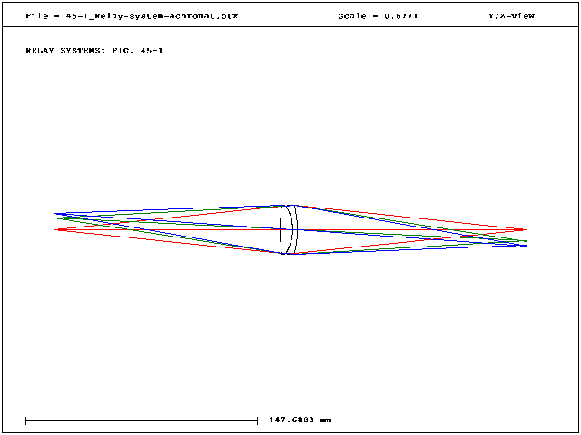
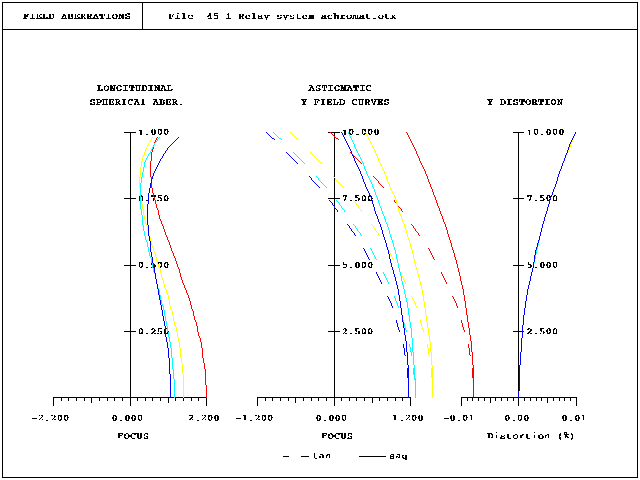
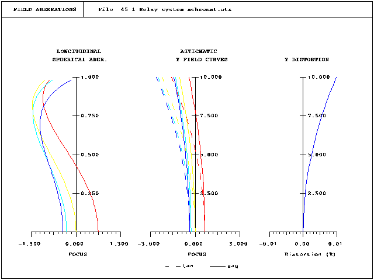

# Basic Relay Systems

Just to get familiar with the macro system, I played around with the example system in Figure 45-1

 "Achromat relay lens")

When initially loading the system, the longitudinal spherical aberration is systematically offset.  

 "Example as loaded, before optimization"

But that is okay, because it gives an excuse to play around with the optimizer.  I first deleted all the variables and varied the first and last surface thicknesses, with targets of unit magnification and 0 on axis longitudinal aberration for wavelength #2 (546nm).  Here is what I get post optimization:

 "Example after optimization"

This also drove the astigmatism to 0 for that wavelength, and now the plots look similar to Figure 45-2 in the book, although with color changes, all the astigmatic field curves, and the distortion scale is different.  

